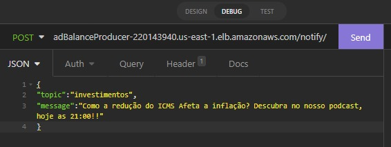
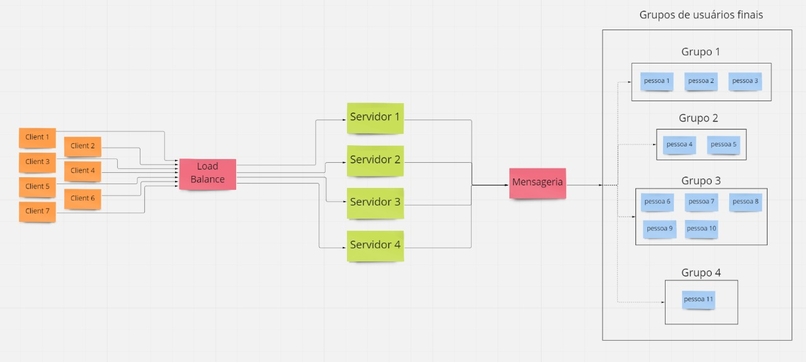

# A Notification System With Kafka
[](https://nodejs.org/api/cli.html)

***
> Gustavo Santiago Sousa <br>
> Bachelor of Exact and Technological Sciences - UFRB <br>
> Graduating in Computer Engineering - UFRB <br>

- [Getting Started](#Getting_Started)
  - [requisites](#requisites)
- [About The Project](#aboutProject)
  - [Kafka Sever](#KafkaServer)
  - [Creating connection with kafka](#CreatingConnectionWithKafka)
  - [Producer](#producer)
  - [Consumer](#Consumer)
  - [Final Client](#FinalClient)
  - [Final Architecture](#architecture) 
- [Final considerations](#finalConsideration)
***
## <a id="Getting_Started" />Getting Started
### <a id="requisites" />Requisites
- [Node.js 18.5](https://nodejs.org/api/cli.html)
- [KafkaJS](https://kafka.js.org/docs/getting-started)
- [Kafka](https://kafka.apache.org/quickstart)
- [Socket-io](https://socket.io/docs/v2/server-installation/)

 <a id="aboutProject" />About The Project
- 
The system basically consists of a server producer that connects to a kafka server and listens for http requests on port 9000. So when a request arrives, the topic to be sent is extracted and the message and the producer sends this data to kafka. On the other side, a consumer server listens for requests on port 9005. When a request arrives from the client, a socket connection is established for greater dynamism in the display of information on the client. Then after establishing the connection, the consumer connects to the kafka server and sends via socket to the client every message it receives from the kafka server

***
## <a id="KafkaServer" />Kafka Server

To create a kafka server, just install kafka following its [documentation](https://kafka.apache.org/quickstart) and when it starts, run these two commands*

```sh
$ bin/zookeeper-server-start.sh config/zookeeper.properties
```
```sh
$ bin/kafka-server-start.sh config/server.properties
```
*It needs to be on different terminals

**Kafka requires some memory and so, if you are thinking of a cloud solution like AWS, the cheapest solution I found in the current conditions of the Kafka version and AWS machines was to run the server on a t2. medium

***As we are accessing kafka from another machine, we import it in the config/server-properties file, uncomment the PLAINTEXT and add the public DNS of the machine that is running it. This will allow other machines to access kafka remotely via your public DNS. This [guide](https://kafka.apache.org/090/documentation.html#security_configbroker) might help

****The public DNS of AWS machines changes every time they stop and run again, so make sure this data is correct (this can save you a lot of debugging time lol)

***

## <a id="CreatingConnectionWithKafka" />Creating Connection With Kafka

The creation process is basically the same in consumer and producer, and consists of importing a library that will manage the connection with the kafka server (kafkajs) and instantiating a new Kafka object with brokers: the public DNS of the machine that is running the kafka

In that case it would be something like this

```sh
const { kafka } = require('kafkajs')
const kafka = new Kafka({
  clientId: 'my-app',
  brokers: ['ec2-54-234-169-250.compute-1.amazonaws.com:9092'],
})
```
Now we will see the specifics of each one, starting with the producer.

***
### <a id="producer" />Producer

The producer is created with allowAutoTopicCreation: true, to allow that if the user passes a topic that does not yet exist in the kafka server, it is automatically created

```sh
    const producer = kafka.producer({
        allowAutoTopicCreation: true
    })
```
then a server is executed, it starts listening on port 9000 and with a post type route established on the /notify endpoint. That way, when the client wants to notify others, just send a request on port :9000/notify. The request body data will be extracted and sent by the producer
```sh
    async function enviaNotificacao(data) {
  await producer.send({
    topic: data.topic,
    messages: [
      { value: data.message},
    ],
  })
}

app.post('/notify', jsonParser, (req, res) => {
  let data = req.body
  res.send(data);
  enviaNotificacao(data)
})


app.listen(9000, async ()=>{
  await producer.connect()
}
```

***


 <a id="Consumer" />Consumer
- 
The consumer in turn is created like this:

```sh
 const consumer = kafka.consumer({ groupId: 'test-group' })
```
As in the producer, a server is started, listening on port 9005. When a client connects, a socket request is created, in order to transmit the messages arriving from the Kafka Server through the consumer in real time to the client.

```sh
    server.listen(9005, async ()=>{
  await consumer.connect()
  await consumer.subscribe({ topic: 'investimentos', fromBeginning: true })
  
  io.on('connection', async (socket)=>{

    await consumer.run({
      eachMessage: async ({ topic, partition, message }) => {
        socket.emit('message',message.value.toString())
      },
    })
  });
```

***** Producer and consumer only run kafkaJS without any other heavy libs, so t2.micro worked fine for them


<a id="FinalClient" />Final Client

The final client basically consists of a VueJS component. Since VueJS is reactive, it re-renders when one of its used properties changes. Then, an array was created with the messages that it should display on screen (a property used), and the socket connection was established with port 9005. Then, whenever the consumer sent a message from kafka, it received, changed its props and consequently re-rendered this message to the screen.

```sh
 <template>
    <div>
        <h1>Notificações Recebidas:</h1>
        <p v-for="(message,index) in messages" :key="index">
            {{message}}
        </p>
    </div>
</template>

<script>
import { io } from 'socket.io-client'
export default {
    data(){
        return{
            messages:[],
            connection: io('ec2-34-204-2-241.compute-1.amazonaws.com:9005')
        }
    },
  mounted(){
    this.connection.on('message', (message) => {
      this.messages.push(message)
      console.log(message)
    })
    }
}
</script>
```
<a id="architecture" />Final Architecture
Thinking about the case where several customers would be sending notifications to their end customers. a new producer instance was created and a loadBalance to distribute the load between the servers. So clients who want to send notifications, now need to send them through load balance, like this:



So, the final architecture looked like this:




